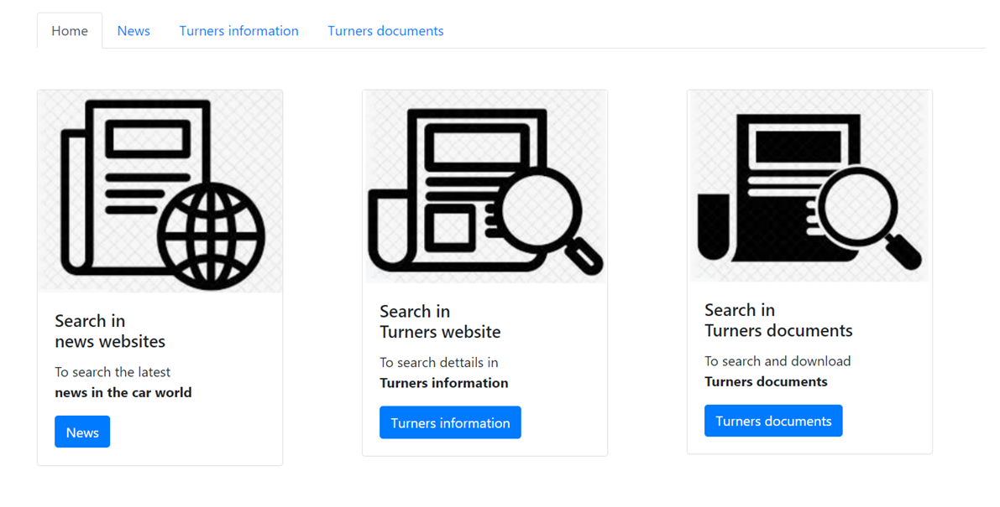
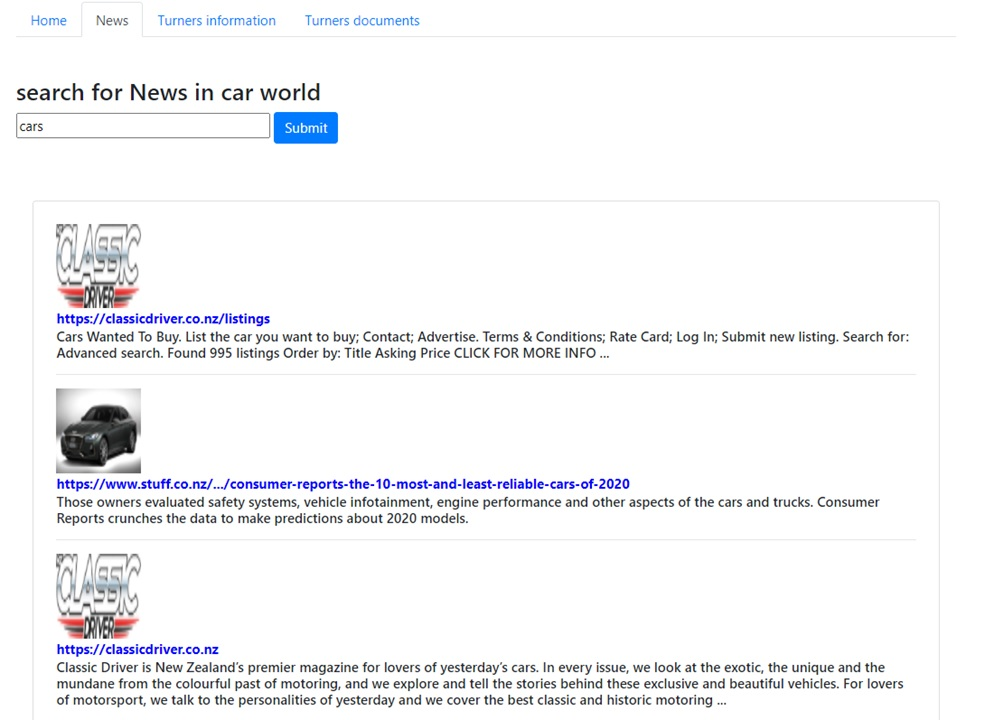

# Flask-NLP-BingSearch
Web application in flask to use the Azure's APIs Bing Search and LUIS

Homepage:

=======================================================
First functionality:
A personalized search engine (Azure Bing Search)
Allow to search the keywords just in selected website

=======================================================
Second functionality:
The Azure's APIs Luis and QnA allow 
to search information inside documents

=======================================================
First functionality:
The Azure's APIs Luis allow to retrieve document inside the folder:

if the user click the button the file is sent like attached
