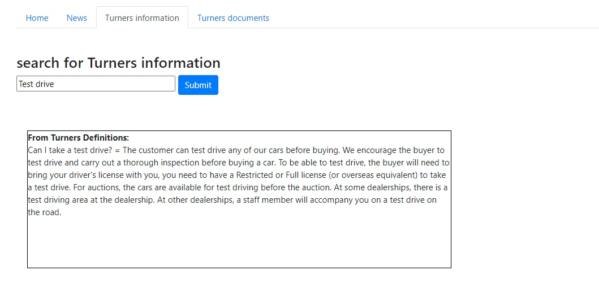
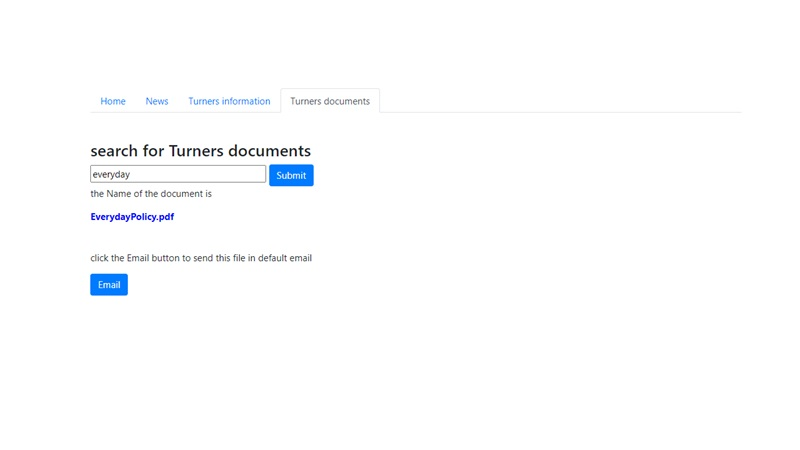
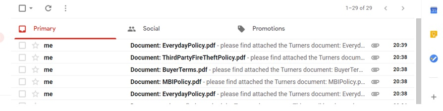

# Flask-NLP-BingSearch
<h1>Web application in flask</h1>
<h2>Web application in flask to use the Azure's APIs Bing Search and LUIS</h2>

<h2>Homepage:</h2> 

 
<h2>First functionality:</h2> 
A personalized search engine (Azure Bing Search) 
Allow to search the keywords just in selected website 
 
 

<h2>Second functionality:</h2> 
The Azure's APIs Luis and QnA allow  
to search information inside documents 
 

 
<h2>Thirt functionality:</h2> 
The Azure's APIs Luis allow to retrieve document inside the folder: 
 
 

if the user click the button the file is sent like attached 
